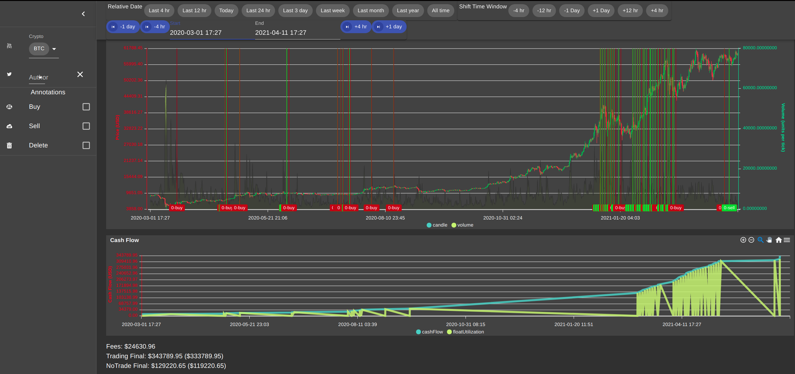
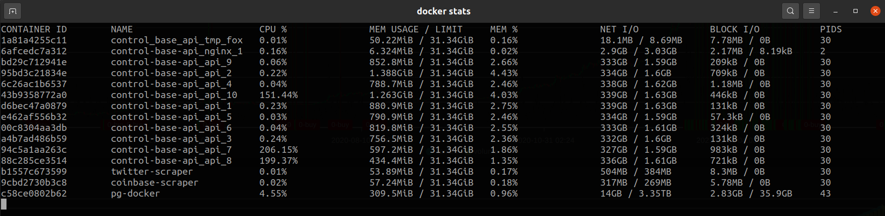
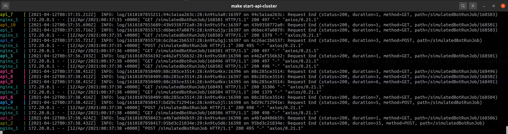

# muskbot-architecture

Documenting the architecture of my day trading bot, [muskbot](https://github.com/cazlo/muskbot)

## Contents
- [C4 diagrams (context, containers, components)](docs/c4/README.md)
- [Architectural decision records](docs/adr/README.md)

## Technologies Used

### data ingestion and processing
- node 14 (javascript)
- ramda (functional programming utils)
- bignumber.js (store and math on decimal values with exact precision. avoids floating point math issues)
- hapijs (RESTful web service framework)
- ml-js (machine learning utils)
- axios (http client)
- knex (sql utilities)
- dayjs (replacement of moment )

### data persistence
- postgres
- knex.js (migrations)

### ui
- react js
- react redux
- material-ui
- apex charts

### operational glue
- docker
- docker-compose
- GNU Make
- bunyan (easy way to switch between pretty printing logs for human reading and printing json logs for aggregators)
- dotenv (easy way to keep secrets like API tokens in .env file and out of version control)

