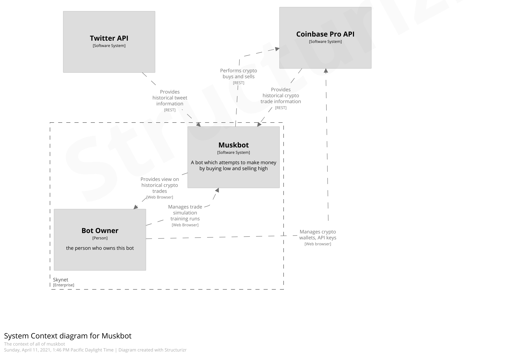
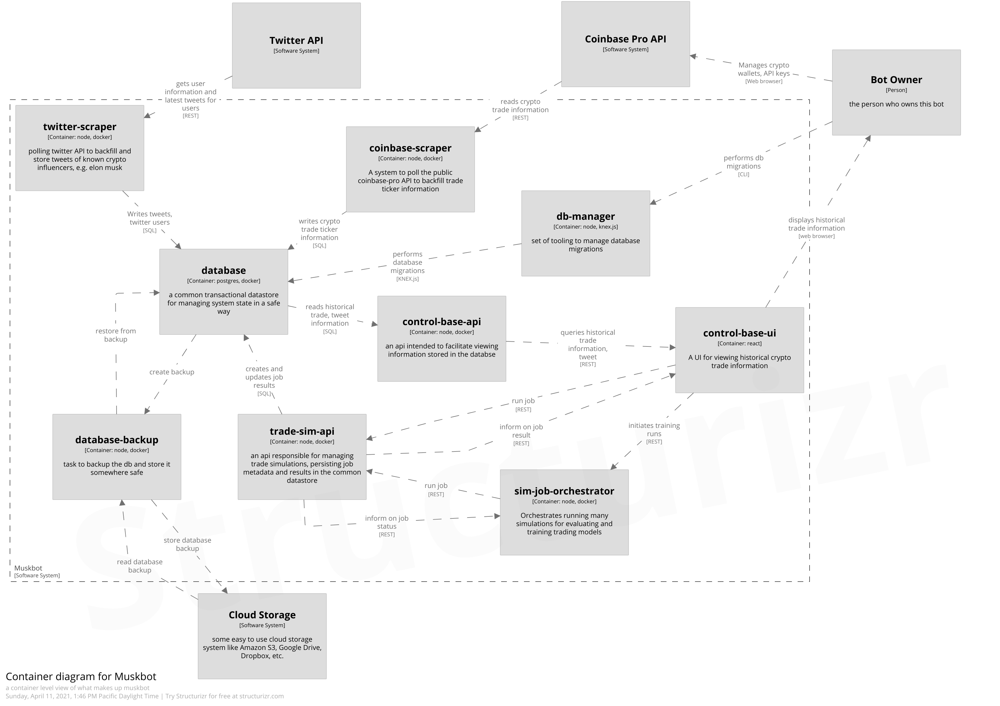
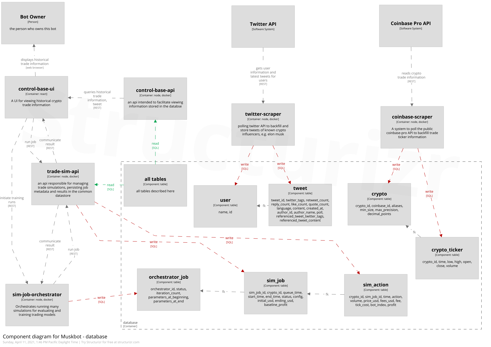
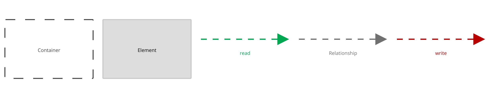

# Level 1 - Begin



Muskbot is a series of software components intended to
perform analysis of various trading algorithms
for trading cryptocurrencies.

The main goal of this system is to efficiently and quickly
find algorithms which beat the "index" investing benchmark
(buy early and hold until absolute end of timeframe).

After sufficient iterations, the bot owner can make data driven
decisions about which algorithms to employ for day trading.

The same algorithms which are run through historical simulations
can be let loose into the wild. The bot owner monitors actual
returns and decides when to ultimately cash out.

Many concurrent bot executions are to be expected for both training
and actual running purposes.  This is to support multiple things:
- many concurrent cryptos to analyze
- many concurrent algorithms to analyze the same crypto

# Level 2 - Must Go Deeper


## Persistent data storage
single postgres database to facilitate easy joining of data

db migrations facilitated by knex.js lib through `db-manager`

## Long-running ETL jobs
- `coinbase-scraper` for getting and persisting 1 minute granularity crypto ticker information (1 minute open, close, high, low, volume)
- `twitter-scraper` for getting and persisting tweets of known crypto influencers

## Management UI
- `control-base-ui` react redux application to view and manage historical trade information
- `control-base-api` somewhat simple proxy over querying the db. only used by UI to avoid UI doing direct DB queries

## Simulating and recording trades
- `sim-job-orchestrator` something to manage the complexity of generating simulation jobs
  and ensuring they get worked to completion. the main point of this component
  is to act as a queue of work to throttle concurrent execitons of trade simulations.
  this way we can cheaply run a bunch of concurrent simulations on the same machine
- `trade-sim-api` something to encapsulate the logic of performing and recording trade history
  over some input timeframe.  essentially this process:
```
input is begin, end, strategy handler
tradeHistory = []
for each ticker in allTickersForJobTimeframe(begin, end):
   given current trade history
   and current tick
   does strategy handler indicate we buy, sell, or hold?
   if buy or sell
      push to tradeHistory metadata about the event (e.g. profit from sale, price)
```

# Level 3 - Even More Details

Diving more into the data model and how various components interact with it



